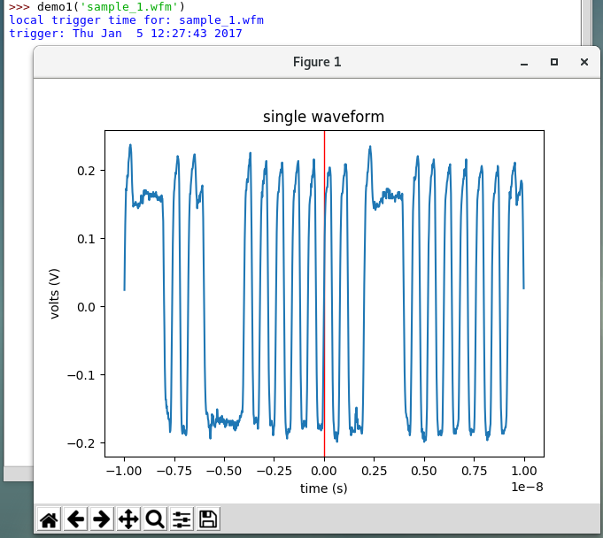
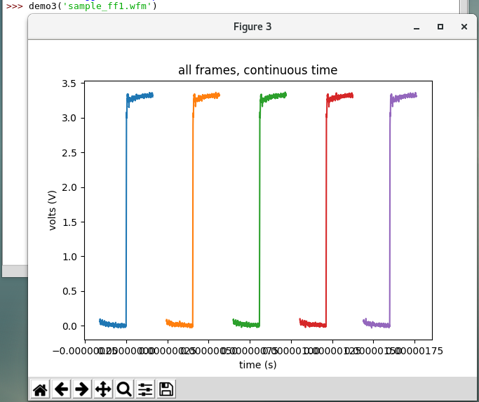

# Read WFM File Example
Original Attribution: Carl M - Tektronix Applications

This is a proof-of-concept module and examples demonstrating extraction of voltage vs time records from little-endian version 3 *.WFM files. It also supports FastFrame records and the trigger time stamp information.

For a full definition of the Tektornix oscilloscope *.WFM file, refer to the Performance Oscilloscope Reference Waveform File Format manual (Tektronix part # 077-0220-10, https://www.tek.com/oscilloscope/dpo7000-digital-phosphor-oscilloscope-manual-4)

please note: Tektronix AWGs share use of the '.WFM' file extension but have a different structure.
AWG WFMs are defined in the AWG400/500/600 Series Programmer Manual Manual (070A81050,https://www.tek.com/awg410-manual/awg400-500-600-series-programmer-manual) on pdf page 161

## Expected output of sample wfms

<!-- markdown-link-check-disable -->
Resources
---------
Original Discussion: https://forum.tek.com/viewtopic.php?f=580&t=141081
