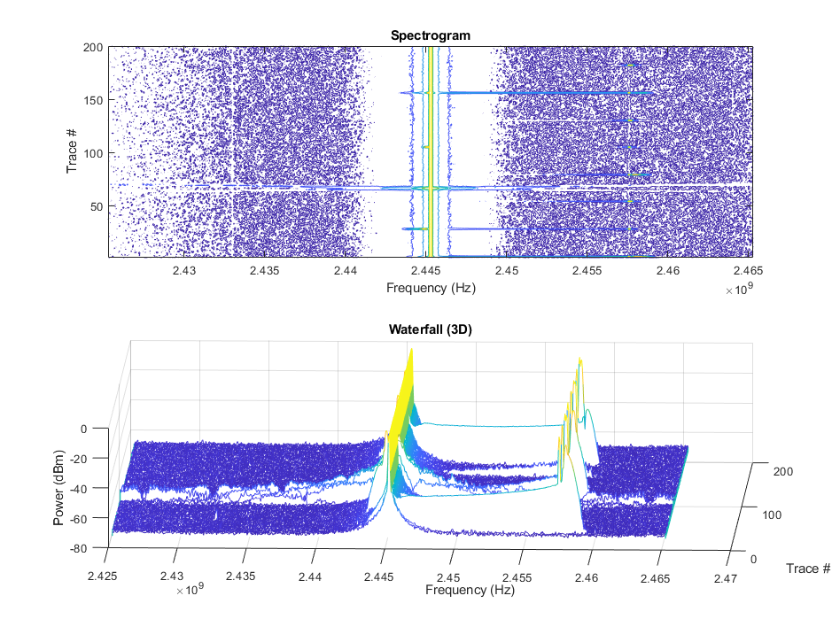
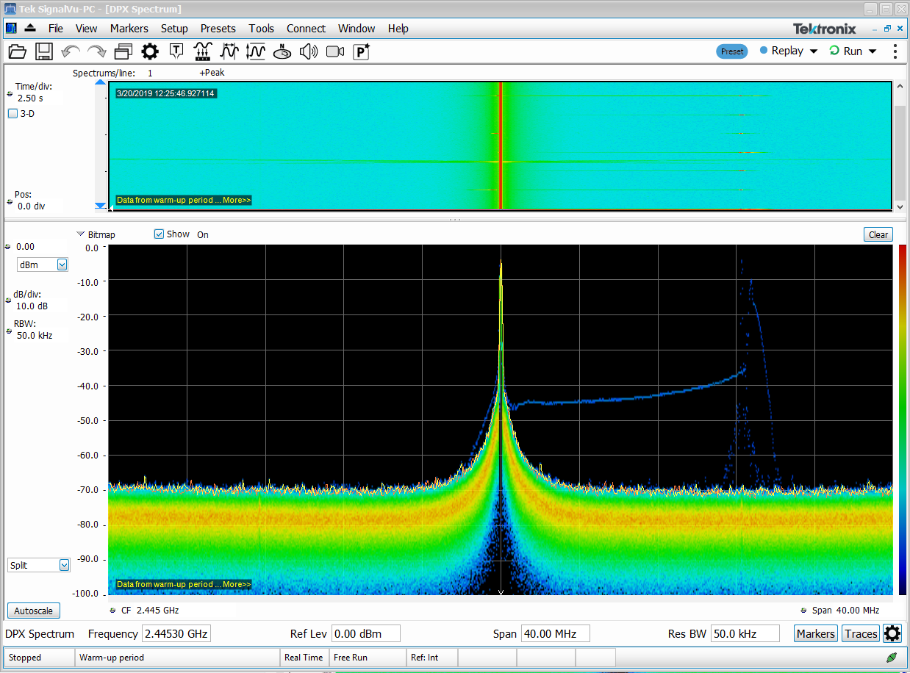

# RSA MATLAB dpx plot
Original Attribution: Andrew C. - Tektronix Applications

This simple code shows how DPX trace data, saved in the form of a .mat file, can be extracted and plotted in MATLAB. It takes the trace data from the file, then plots it as a Spectrogram and Waterfall(3D) plot. These .mat files have the following four variables in addition to the trace data: rsaMetadata, SpectraCenter, SpectraSpan, and TDelta. The number of loop iterations is set to be equal to the total number of traces. Since the .mat file contains the trace data + 4 variables, the number of iterations is calculated by determining the total number of variables in the file, then subtracting this value by 4. This code is intended as a proof of concept to get trace data from a .mat file into the MATLAB workspace. It can easily be expanded on for more advanced analysis.

---

To get the correct file format when saving data, follow these steps:
1) In SignalVu-PC, stop the current acquisition. Then go to File -> Save As
2) Select 'Acq data export with Setup (MAT) (*.mat)' for the 'Save as type' field, then click Save.
NOTE: The directory you save this data should be the same directory where the .m file is saved.
3) Once the 'File Contents' window pops up, select 'DPX spectra' for Data types then 'All in history' for Data records. Then click Save.

Resources
---------
Original Discussion:
https://forum.tek.com/viewtopic.php?f=580&t=141539
